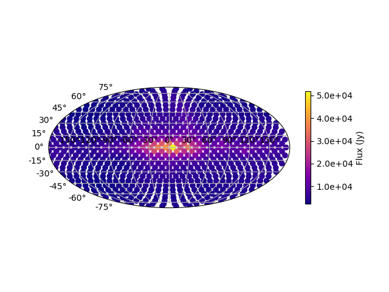
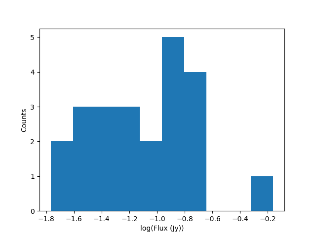

Tutorial
========

By default, following the tutorial will write any files to the current working directory.
Alternatively you can change the location the output files are saved to
by changing the arguments to the ``os.path.join`` calls.
When running the tutorial during test suite execution,
output files are written to a temporary directory created by pytest.

--------
SkyModel
--------

SkyModel is the primary user class, it can represent catalogs of point sources or
diffuse models as HEALPix maps. A number of methods are available for reading in and
writing out files as well as various transformations, including calculating fully
polarized coherencies in the local Alt/Az basis (useful for visibility simulators).
This tutorial should give a basic introduction to all the methods.

SkyModel: Reading in files and creating SkyModel objects
--------------------------------------------------------

a) FHD files
************
.. code-block:: python

  >>> import os
  >>> from pyradiosky import SkyModel
  >>> from pyradiosky.data import DATA_PATH
  >>> sm = SkyModel()

  >>> # Use the `read` method, optionally specify the file type. FHD default: expand_extended=True.
  >>> filename = os.path.join(DATA_PATH, "fhd_catalog.sav")
  >>> sm.read(filename)
  >>> # If the file type is not properly recognized, set the `filetype` parameter
  >>> sm.read(filename, filetype="fhd")

  >>> # Use the `from_file` method to create SkyModel object without initalizing
  >>> # an empty object, optionally specify the file type.
  >>> # FHD default: expand_extended=True.
  >>> sm = SkyModel.from_file(filename)

b) GLEAM catalog
****************
The GLEAM catalog can be read in with several different spectral types:

  - **subband**: This is the default because it best matches the way the catalog
  was taken, with source fluxes measured at a number of different frequencies.
  Note that some (generally fainter) sources have NaNs and negatives in their
  Stokes I values for some or all frequencies. See :ref:`selecting_data` for
  ways to remove them.

  - **spectral_index**: This reads in the fitted flux density at 200 MHz and the
  fitted spectral index. Note that the spectral indices for some sources are set
  to NaNs because the source flux densities were not well-fit with a power law.
  Even some bright sources have NaNs for spectral indices. These sources also
  have NaNs for their fitted flux densities at 200 MHz.

  - **flat**: This reads in the wide band integrated flux density for each source.
  It does not have any sources with NaNs or negatives in their Stokes I values but
  also contains no information about how the flux densities evolve with frequency.

  Note that the GLEAM paper specifies that the 30.72 MHz bandwidth is subdivided
  into four 7.68 MHz sub-channels. But that clashes with the frequencies and
  edges listed in the catalog documentation which are spaced by exactly 8MHz.
  By default, this method uses the catalog frequency values. To use our best
  guess of the real values (which are not specified in the paper), set
  ``use_paper_freqs=True``. This option only has an effect if spectral_type="subband".

.. code-block:: python

  >>> import os
  >>> from pyradiosky import SkyModel
  >>> from pyradiosky.data import DATA_PATH
  >>> sm = SkyModel()

  >>> filename = os.path.join(DATA_PATH, "gleam_50srcs.vot")

  >>> # Use the `from_file` method to create SkyModel object without initalizing
  >>> # an empty object, optionally specify the file type.
  >>> # GLEAM defaults: spectral_type="subband", with_error=False
  >>> sm = SkyModel.from_file(filename)

c) VOTable files
****************
.. code-block:: python

  >>> import os
  >>> from pyradiosky import SkyModel
  >>> from pyradiosky.data import DATA_PATH
  >>> sm = SkyModel()

  >>> # Use the `read` method, optionally specify the file type. VOTable required parameters: table_name, id_column,
  >>> # lon_column, lat_column, and flux_columns.
  >>> filename = os.path.join(DATA_PATH, "simple_test.vot")
  >>> # The following are all functionally the same:
  >>> sm.read(filename, table_name="VIII_1000_single", id_column="source_id",
  ...         lon_column="RAJ2000", lat_column="DEJ2000", frame="fk5", flux_columns="Si")

  >>> # Use the `from_file` method to create SkyModel object without initalizing
  >>> # an empty object, optionally specify the file type.
  >>> # VOTable required parameters: table_name, id_column, lon_column, lat_column, and flux_columns.
  >>> sm = SkyModel.from_file(filename, table_name="VIII_1000_single", id_column="source_id",
  ...                         lon_column="RAJ2000", lat_column="DEJ2000", frame="fk5", flux_columns="Si")

d) Text files
*************

Note that we have a fairly strict definition of the columns and formatting of text
catalog files. See the documentation on :meth:`pyradiosky.SkyModel.read_text_catalog`
for details.

.. code-block:: python

  >>> import os
  >>> from pyradiosky import SkyModel
  >>> from pyradiosky.data import DATA_PATH
  >>> sm = SkyModel()

  >>> # Use the `read` method, optionally specify the file type. See API docs for required columns of text file.
  >>> filename = os.path.join(DATA_PATH, "pointsource_catalog.txt")
  >>> sm.read(filename)

  >>> # Use the `from_file` method to create SkyModel object without initalizing
  >>> # an empty object, optionally specify the file type.
  >>> sm = SkyModel.from_file(filename)

e) Skyh5 files
**************

SkyH5 is a new HDF5 based file format based on the SkyModel object. The format is fully
described in the `SkyH5 memo <https://github.com/RadioAstronomySoftwareGroup/pyradiosky/tree/main/docs/references/sky5_memo.pdf>`__.

.. code-block:: python

  >>> import os
  >>> from pyradiosky import SkyModel
  >>> from pyradiosky.data import DATA_PATH
  >>> sm = SkyModel()

  >>> # Use the `read` method, optionally specify the file type.
  >>> filename = os.path.join(DATA_PATH, "gsm_icrs.skyh5")
  >>> sm.read(filename)

  >>> # Use the `from_file` method to create SkyModel object without initalizing
  >>> # an empty object, optionally specify the file type.
  >>> sm = SkyModel.from_file(filename)

f) Creating a Skymodel with a noise-like Healpix map
****************************************************

This can be useful for simulating rudimentary EoR HI power spectrum signal maps,
although they are noise-like so do not contain the real bubble structures.

.. code-block:: python

  >>> import os
  >>> import numpy as np
  >>> from pyradiosky import utils
  >>> sm = utils.flat_spectrum_skymodel(
  ...     variance=1e-6, nside=256, freqs=np.linspace(150e6, 180e6, 20)
  ... )
  >>> # the expected power spectrum amplitude is recorded in the history
  >>> print(sm.history[0:74])
  Generated flat-spectrum model, with spectral amplitude 0.037 K$^2$ Mpc$^3$

SkyModel: Plotting
------------------

a) Plotting extended models
***************************
.. code-block:: python

  >>> import os
  >>> import numpy as np
  >>> import matplotlib.pyplot as plt
  >>> from pyradiosky import SkyModel
  >>> from pyradiosky.data import DATA_PATH
  >>> sm = SkyModel()

  >>> # This is a small FHD save file that contains extended source models
  >>> # for Fornax A and Pictor A. The two lobes of Fornax are identified
  >>> # as separate sources
  >>> filename = os.path.join(DATA_PATH, "fhd_catalog_with_beam_values.sav")
  >>> sm.read_fhd_catalog(filename)

  >>> # First, let's just plot the location of all the components
  >>> _ = plt.scatter(sm.ra, sm.dec)
  >>> _ = plt.xlabel("RA (deg)")
  >>> _ = plt.ylabel("Dec (deg)")
  >>> # for RA to be in conventional order, use .value when integer required
  >>> _ = plt.xlim(max(sm.ra.value), min(sm.ra.value))
  >>> # extends axis limits 5% beyond given limits
  >>> plt.autoscale()
  >>> plt.show() # doctest: +SKIP
  >>> plt.savefig("Images/fhd_catalog_extended_models_radec.png")
  >>> plt.clf()

.. code-block:: python

  >>> print(sm.Ncomponents)
  4597
  >>> print(sm.Nfreqs)
  1
  >>> print(sm.component_type)
  point
  >>> print(sm.spectral_type)
  spectral_index
  >>> print(np.unique(sm.reference_frequency))
  [1.82435e+08 2.15675e+08] Hz
  >>> print(np.unique(sm.spectral_index))
  [-0.8]

  >>> # print the unique extended model group names
  >>> # Ideally, these should contain source names. Unfortunately in this file
  >>> # all we have are source id numbers.
  >>> print(np.unique(sm.extended_model_group))
  ['32768' '32769' '32770']

  >>> # Next plot the reference frequency and spectral index of the components.
  >>> # There are two reference frequencies, one for Pic A and one for Fornax.
  >>> # They have the same spectral index in this file, which is not right. This is
  >>> # presumably caused by them being set to the FHD default because they weren't set properly.
  >>> _ = plt.scatter(sm.reference_frequency.to("MHz"), sm.spectral_index)
  >>> _ = plt.xlabel("Reference Frequency (MHz)")
  >>> _ = plt.ylabel("Spectral Index")
  >>> plt.show() # doctest: +SKIP
  >>> plt.savefig("Images/fhd_catalog_extended_models_refspec.png")
  >>> plt.clf()

.. image:: Images/fhd_catalog_extended_models_refspec.png
    :width: 600

.. code-block:: python

  >>> # Find the index array for the first source (Pic A)
  >>> index_32768 = np.nonzero(sm.extended_model_group == "32768")[0]
  >>> # confirming that there is one reference frequency for this extended model group
  >>> print(np.unique(sm.reference_frequency[index_32768]))
  [2.15675e+08] Hz

  >>> # plots of fluxes are only sensible if they are all from the same frequency.
  >>> # The plots below show fluxes for Pic A at the (common) reference frequency
  >>> # log taken since these fluxes have different orders of magnitude
  >>> _ = plt.hist(np.log(sm.stokes.value[0,0,index_32768]), bins=20)
  >>> _ = plt.xlabel("log(Flux (Jy))")
  >>> _ = plt.ylabel("Counts")
  >>> plt.show() # doctest: +SKIP
  >>> plt.savefig("Images/fhd_catalog_extended_models_fluxcounts.png")
  >>> plt.clf()

.. code-block:: python

  >>> # Now plot all the components for the Pic A extended source model, with components colored by their flux
  >>> _ = plt.scatter(x=sm.ra[index_32768],y=sm.dec[index_32768],c=sm.stokes[0,0,index_32768].value,cmap="plasma")
  >>> cbar=plt.colorbar(label="Flux (Jy)", orientation="vertical",shrink=.75)
  >>> _ = plt.xlim(max(sm.ra.value[index_32768]), min(sm.ra.value[index_32768]))
  >>> plt.autoscale()
  >>> _ = plt.xlabel("RA (deg)")
  >>> _ = plt.ylabel("Dec (deg)")
  >>> plt.show() # doctest: +SKIP
  >>> plt.savefig("Images/fhd_catalog_extended_models_radec_picA.png")
  >>> plt.clf()

b) Plotting fluxes with error bars
**********************************
.. code-block:: python

  >>> import os
  >>> from pyradiosky import SkyModel
  >>> from pyradiosky.data import DATA_PATH
  >>> import matplotlib.pyplot as plt

  >>> # This files contains the first 50 sources from the GLEAM catalog.
  >>> filename = os.path.join(DATA_PATH, "gleam_50srcs.vot")
  >>> # Set the `with_error` parameter to True to read in the flux errors to the
  >>> # `stokes_error` attribute
  >>> sm = SkyModel.from_file(filename, with_error = True)

  >>> # Plot the fluxes as a function of frequencies with error bars
  >>> # flux for stokes parameter = 0 (stokes I or unpolarized), Nfreqs index = : (all frequencies),
  >>> # Ncomponents index = 0 (first component)
  >>> _ = plt.errorbar(sm.freq_array.to("MHz"), sm.stokes[0,:,0], yerr = sm.stokes_error[0,:,0], fmt="o", ecolor = "red", color="yellow")
  >>> _ = plt.xlabel("Frequency (MHz)")
  >>> _ = plt.ylabel("Flux (Jy)")
  >>> plt.show() # doctest: +SKIP
  >>> plt.savefig("Images/gleam_50srcs_freqflux.png")
  >>> plt.clf()

.. image:: Images/gleam_50srcs_freqflux.png
    :width: 600

.. _plotting_healpix_maps:

c) Plotting Healpix maps, converting to pixel type and changing coordinate frames
*********************************************************************************

.. code-block:: python

  >>> import os
  >>> import numpy as np
  >>> import math
  >>> import matplotlib.pyplot as plt
  >>> from matplotlib.patches import Polygon
  >>> from pyradiosky import SkyModel
  >>> from pyradiosky.data import DATA_PATH
  >>> from astropy_healpix import HEALPix
  >>> from astropy.coordinates import SkyCoord
  >>> sm = SkyModel()

  >>> # This is a coarse Healpix map of the Global Sky Model (GSM)
  >>> filename = os.path.join(DATA_PATH, "gsm_icrs.skyh5")
  >>> sm.read_skyh5(filename)

  >>> # First plot the pixel locations on a flat RA/Dec grid.
  >>> ra, dec = sm.get_lon_lat()
  >>> _ = plt.scatter(ra, dec)
  >>> _ = plt.xlim(max(ra.value), min(ra.value))
  >>> plt.autoscale()
  >>> _ = plt.xlabel("RA (deg)")
  >>> _ = plt.ylabel("Dec (deg)")
  >>> plt.show() # doctest: +SKIP
  >>> plt.savefig("Images/gsm_icrs_radec.png")
  >>> plt.clf()

.. image:: Images/gsm_icrs_radec.png
    :width: 600

.. code-block:: python

  >>> # Print some information about this object
  >>> # a HEALPix map has Ncomponents = 12*nside^2, where components are pixels
  >>> print(sm.Ncomponents)
  768
  >>> print(sm.Nfreqs)
  10
  >>> print(sm.component_type)
  healpix
  >>> print(sm.spectral_type)
  full
  >>> print(sm.freq_array)
  [5.00000000e+07 6.11111111e+07 7.22222222e+07 8.33333333e+07
   9.44444444e+07 1.05555556e+08 1.16666667e+08 1.27777778e+08
   1.38888889e+08 1.50000000e+08] Hz
  >>> print(sm.hpx_inds[:10])
  [0 1 2 3 4 5 6 7 8 9]
  >>> print(sm.hpx_order)
  ring
  >>> print(sm.nside)
  8
  >>> print(sm.frame)
  icrs

  >>> # Plot a histogram of the Stokes I fluxes
  >>> _ = plt.hist(np.log(sm.stokes.value[0,0,:]), bins=100)
  >>> _ = plt.xlabel("log(Flux (Jy))")
  >>> _ = plt.ylabel("Counts")
  >>> plt.show() # doctest: +SKIP
  >>> plt.savefig("Images/gsm_icrs_fluxcounts.png")
  >>> plt.clf()

.. image:: Images/gsm_icrs_fluxcounts.png
    :width: 600

.. code-block:: python

  >>> # Use the astropy_healpix library to get some information about the map
  >>> hp = HEALPix(sm.nside, sm.hpx_order, sm.frame)
  >>> print(hp.pixel_area)
  0.016362461737446838 sr
  >>> print(hp.pixel_resolution)
  439.74226071262797 arcmin

  >>> # Now plot the pixels on a Mollweide projection with flux shown in color
  >>> ra, dec = sm.get_lon_lat()
  >>> _ = plt.subplot(111, projection="mollweide")
  >>> plt.grid(True)
  >>> _ = plt.scatter(ra.wrap_at('180d').radian, dec.radian,c=sm.stokes[0,0,:].value,cmap="plasma")
  >>> cbar=plt.colorbar(label="Flux (Jy)", orientation="vertical",shrink=.5, format="%4.1e")
  >>> plt.show() # doctest: +SKIP
  >>> plt.savefig("Images/gsm_icrs_flux_molliwede.png")
  >>> plt.clf()

.. code-block:: python

  >>> # It'd be nice to see this in a galactic frame.
  >>> # For `point` components, the frame can be changed by using the `transform_to`
  >>> # method, which just calls the astropy SkyCoord method of the same name.
  >>> # For Healpix maps, though, this isn't right because Healpix pixel locations
  >>> # are defined in the desired frame, so we actually need to interpolate to the new pixel locations.
  >>> sm_galactic = sm.healpix_interp_transform("galactic", inplace=False)

  >>> # Now plot the pixels on a Mollweide projection with flux shown in color
  >>> l, b = sm_galactic.get_lon_lat()
  >>> _ = plt.subplot(111, projection="mollweide")
  >>> plt.grid(True)
  >>> _ = plt.scatter(l.wrap_at('180d').radian, b.radian,c=sm_galactic.stokes[0,0,:].value,cmap="plasma")
  >>> cbar=plt.colorbar(label="Flux (Jy)", orientation="vertical",shrink=.5, format="%4.1e")
  >>> plt.show() # doctest: +SKIP
  >>> plt.savefig("Images/gsm_galactic_flux_molliwede.png")
  >>> plt.clf()

.. code-block:: python

  >>> # We can compare this to converting each healpix pixel to a point sources and
  >>> # converting those sources to galactic coordinates (avoiding the interpolation)
  >>> sm_point = sm.copy()
  >>> sm_point.healpix_to_point()
  >>> sm_point.transform_to("galactic")
  >>> pt_l, pt_b = sm_point.get_lon_lat()
  >>> _ = plt.subplot(111, projection="mollweide")
  >>> plt.grid(True)
  >>> _ = plt.scatter(pt_l.wrap_at('180d').radian, pt_b.radian,c=sm_point.stokes[0,0,:].value,cmap="plasma")
  >>> cbar=plt.colorbar(label="Flux (Jy)", orientation="vertical",shrink=.5, format="%4.1e")
  >>> plt.show() # doctest: +SKIP
  >>> plt.savefig("Images/gsm_point_galactic_flux_molliwede.png")
  >>> plt.clf()

SkyModel: Creating and writing out catalogs
-------------------------------------------

a) Creating and writing out healpix catalog
*******************************************
.. code-block:: python

  >>> import os
  >>> import numpy as np
  >>> import matplotlib.pyplot as plt
  >>> from astropy import units
  >>> from pyradiosky import SkyModel

  >>> sm = SkyModel(
  ...   component_type="healpix", nside=1, hpx_inds=[0,1,2,3],
  ...   stokes=np.zeros((4,1,4)) * units.K,
  ...   spectral_type="flat", hpx_order="ring", frame="icrs"
  ... )
  >>> print(sm.get_lon_lat())
  (<Longitude [ 45., 135., 225., 315.] deg>, <Latitude [41.8103149, 41.8103149, 41.8103149, 41.8103149] deg>)

  >>> write_file = os.path.join(".", "zero.skyh5")
  >>> sm.write_skyh5(write_file)

b) Creating and writing out point catalog
*****************************************
.. code-block:: python

  >>> import os
  >>> import numpy as np
  >>> from pyradiosky import SkyModel
  >>> from astropy import units
  >>> from astropy.coordinates import (
  ...     SkyCoord,
  ...     EarthLocation,
  ...     Angle,
  ...     AltAz,
  ...     Longitude,
  ...     Latitude,
  ...     Galactic)
  >>> from astropy.time import Time

  >>> array_location = EarthLocation(lat="-30d43m17.5s", lon="21d25m41.9s", height=1073.0)
  >>> time = Time("2015-03-01 00:00:00", scale="utc", location=array_location)
  >>> source_coord = SkyCoord(
  ...     alt=Angle(90, unit=units.deg),
  ...     az=Angle(0, unit=units.deg),
  ...     obstime=time,
  ...     frame="altaz",
  ...     location=array_location)
  >>> icrs_coord = source_coord.transform_to("icrs")
  >>> # unpolarized only
  >>> sm = SkyModel(
  ...   name="zen_source", skycoord=icrs_coord, stokes=[1.0, 0, 0, 0] * units.Jy,
  ...   spectral_type="flat", history = "drawn from zenith_skymodel in test_skymodel.py"
  ... )

  >>> print(sm.name)
  ['zen_source']
  >>> # print(sm.history) to learn where the sky model is drawn from and how it is read/written

  >>> # works for any point component type
  >>> write_file = os.path.join(".", "zen_source.txt" )
  >>> sm.write_skyh5(write_file)

Note that this particular catalog could also be written to a text file, but we
prefer skyh5 files because they can fully support all types of SkyModel objects.
Text files do not support diffuse maps or subband type catalogs or catalogs
with extended_model_groups or catalogs with units other than Jy.

.. _selecting_data:

SkyModel: Selecting data
------------------------

a) Removing sources that do not rise
************************************
.. code-block:: python

  >>> import os
  >>> import numpy as np
  >>> from pyradiosky import SkyModel
  >>> from astropy import units
  >>> from astropy.coordinates import EarthLocation
  >>> from astropy.time import Time, TimeDelta

  >>> # Make a SkyModel object with a grid of sources in the Alt/Az frame
  >>> array_location = EarthLocation(lat="-30d43m17.5s", lon="21d25m41.9s", height=1073.0)
  >>> time = Time("2015-03-01 00:00:00", scale="utc", location=array_location)

  >>> Nras = 20
  >>> Ndecs = 20
  >>> Nsrcs = Nras * Ndecs

  >>> lon = array_location.lon.deg
  >>> ra = np.linspace(lon - 90, lon + 90, Nras)
  >>> dec = np.linspace(-90, 90, Ndecs)

  >>> # to create coordinates for the 400 sources
  >>> ra, dec = map(np.ndarray.flatten, np.meshgrid(ra, dec))
  >>> print(len(ra))
  400
  >>> print(len(dec))
  400
  >>> ra = Longitude(ra, units.deg)
  >>> dec = Latitude(dec, units.deg)

  >>> names = ["src{}".format(i) for i in range(Nsrcs)]
  >>> stokes = np.zeros((4, 1, Nsrcs)) * units.Jy
  >>> # stokes I (unpolarized) sources given 1 Jy flux, otherwise no flux
  >>> stokes[0, ...] = 1.0 * units.Jy

  >>> sm = SkyModel(name=names, ra=ra, dec=dec, frame="icrs", stokes=stokes, spectral_type="flat")

  >>> sm2 = sm.cut_nonrising(array_location.lat, inplace=False)

  >>> print(sm.Ncomponents)
  400
  >>> print(sm2.Ncomponents)
  320

b) Select
*********

The :meth:`pyradiosky.SkyModel.select` method lets you select components to keep on the
object while removing others. Selections can be specified by coordinate or flux ranges
or by component index number. The ``non_nan`` option allows for removing components
with NaN Stokes values at some (``non_nan="any"``) or all (``non_nan="all"``)
frequencies. The ``non_negative`` allows for removing components with negative
Stokes I values.

.. code-block:: python

  >>> import os
  >>> import numpy as np
  >>> import matplotlib.pyplot as plt
  >>> from pyradiosky import SkyModel
  >>> from pyradiosky.data import DATA_PATH
  >>> from astropy import units
  >>> from astropy.coordinates import Longitude, Latitude

  >>> filename = os.path.join(DATA_PATH, "gleam_50srcs.vot")
  >>> sm = SkyModel.from_file(filename)

  >>> # First just plot the source locations and fluxes
  >>> # pick a single frequency to plot fluxes for:
  >>> print(sm.freq_array[13].to("MHz"))
  181.0 MHz

  >>> _ = plt.subplot(111)
  >>> _ = plt.scatter(x=sm.ra, y=sm.dec, c=sm.stokes[0,13,:].value, cmap="plasma")
  >>> cbar=plt.colorbar(label="Flux (Jy)", orientation="vertical",shrink=.75)
  >>> _ = plt.xlim(max(sm.ra.value), min(sm.ra.value))
  >>> plt.autoscale()
  >>> _ = plt.xlabel("RA (deg)")
  >>> _ = plt.ylabel("Dec (deg)")
  >>> plt.show() # doctest: +SKIP
  >>> plt.savefig("Images/gleam_50srcs_radec.png")
  >>> plt.clf()

.. code-block:: python

  >>> # Now plot a histogram of the log fluxes (at 181 MHz)
  >>> _ = plt.hist(np.log(sm.stokes.value[0,13,:]), bins=10)
  >>> _ = plt.xlabel("log(Flux (Jy))")
  >>> _ = plt.ylabel("Counts")
  >>> plt.show() # doctest: +SKIP
  >>> plt.savefig("Images/gleam_50srcs_fluxcounts.png")
  >>> plt.clf()

.. code-block:: python

  >>> print(sm.freq_array)
  [7.60e+07 8.40e+07 9.20e+07 9.90e+07 1.07e+08 1.15e+08 1.22e+08 1.30e+08
   1.43e+08 1.51e+08 1.58e+08 1.66e+08 1.74e+08 1.81e+08 1.89e+08 1.97e+08
   2.04e+08 2.12e+08 2.20e+08 2.27e+08] Hz

  >>> # Now make a copy and select only the sources with 340 < RA < 360
  >>> sm2 = sm.copy()
  >>> sm2.select(lon_range = Longitude([340, 360], units.deg))
  >>> # plot their locations
  >>> _ = plt.scatter(x=sm2.ra, y=sm2.dec, c=sm2.stokes[0,13,:].value, cmap="plasma")
  >>> cbar=plt.colorbar(label="Flux (Jy)", orientation="vertical",shrink=.75)
  >>> _ = plt.xlim(max(sm.ra.value), min(sm.ra.value))
  >>> plt.autoscale()
  >>> _ = plt.xlabel("RA (deg)")
  >>> _ = plt.ylabel("Dec (deg)")
  >>> plt.show() # doctest: +SKIP
  >>> plt.savefig("Images/gleam_50srcs_radec_raselect.png")
  >>> plt.clf()

.. code-block:: python

  >>> # Now make a copy and select only the sources 0.1 Jy < flux < 1 Jy
  >>> # where the fluxes are between 100-200 MHz
  >>> sm3 = sm.copy()
  >>> sm3.select(
  ...    min_brightness=.1*units.Jy, max_brightness=1*units.Jy, brightness_freq_range=[100, 200]*units.MHz
  ... )
  >>> print(sm3.Ncomponents)
  23

  >>> # plot their locations
  >>> _ = plt.scatter(x=sm3.ra, y=sm3.dec, c=sm3.stokes[0,13,:].value, cmap="plasma")
  >>> cbar=plt.colorbar(label="Flux (Jy)", orientation="vertical",shrink=.75)
  >>> _ = plt.xlim(max(sm.ra.value), min(sm.ra.value))
  >>> plt.autoscale()
  >>> _ = plt.xlabel("RA (deg)")
  >>> _ = plt.ylabel("Dec (deg)")
  >>> plt.show() # doctest: +SKIP
  >>> plt.savefig("Images/gleam_50srcs_radec_fluxselect.png")
  >>> plt.clf()

.. image:: Images/gleam_50srcs_radec_fluxselect.png
    :width: 600

.. code-block:: python

  >>> # plot their flux histogram (at 181 MHz)
  >>> _ = plt.hist(np.log(sm3.stokes.value[0,13,:]), bins=10)
  >>> _ = plt.xlabel("log(Flux (Jy))")
  >>> _ = plt.ylabel("Counts")
  >>> plt.show() # doctest: +SKIP
  >>> plt.savefig("Images/gleam_50srcs_fluxcounts_fluxselect.png")
  >>> plt.clf()

c) Selecting Healpix components by distance
*******************************************

The same kinds of selections can be done on point and Healpix components. For
Healpix components, the `astropy_healpix` package can also be used to help identify
components by distance.

.. code-block:: python

  >>> import os
  >>> import numpy as np
  >>> import math
  >>> import matplotlib.pyplot as plt
  >>> from pyradiosky import SkyModel
  >>> from pyradiosky.data import DATA_PATH
  >>> from astropy import units as u
  >>> from astropy_healpix import HEALPix
  >>> sm = SkyModel()

  >>> filename = os.path.join(DATA_PATH, "gsm_icrs.skyh5")
  >>> sm.read_skyh5(filename)

  >>> ra, dec = sm.get_lon_lat()
  >>> _ = plt.subplot(111, projection="mollweide")
  >>> plt.grid(True)
  >>> _ = plt.scatter(ra.wrap_at('180d').radian, dec.radian, c=sm.stokes[0,0,:].value, cmap="plasma")
  >>> cbar=plt.colorbar(label="Flux (Jy)", orientation="vertical",shrink=.5, format="%4.1e")
  >>> plt.show() # doctest: +SKIP
  >>> plt.savefig("Images/gsm_icrs_flux_molliwede.png")
  >>> plt.clf()

.. code-block:: python

  >>> # You can specify component inds to select. First we'll just try selecting the
  >>> # first 50 components.
  >>> sm_new = sm.copy()
  >>> inds = list(range(0, 50))
  >>> sm_new.select(component_inds=inds)

  >>> ra_new, dec_new = sm_new.get_lon_lat()
  >>> _ = plt.subplot(111, projection="mollweide")
  >>> plt.grid(True)
  >>> # Use the vmin & vmax parameters to keep the colors the same as in the original map above
  >>> _ = plt.scatter(
  ...   ra_new.wrap_at('180d').radian,
  ...   dec_new.radian,
  ...   c=sm_new.stokes[0,0,:],
  ...   cmap="plasma",
  ...   vmin=np.min(sm.stokes.value[0,0,:]),
  ...   vmax=np.max(sm.stokes.value[0,0,:])
  ... )
  >>> cbar=plt.colorbar(label="Flux (Jy)", orientation="vertical",shrink=.5, format="%4.1e")
  >>> plt.show() # doctest: +SKIP
  >>> plt.savefig("Images/gsm_icrs_indselect_molliwede.png")
  >>> plt.clf()

.. code-block:: python

  >>> # Let's change over to galactic coordinates using healpix_interp_transform
  >>> sm_galactic = sm.copy()
  >>> sm_galactic.healpix_interp_transform("galactic")

  >>> # Figuring out which indices you want can be a little complicated, especially since
  >>> # there are two possible indexing schemes for Healpix maps ('ring' and 'nested').
  >>> # Of course you can do it by using the pixel coordinates, but there are also
  >>> # some nice convenience functions in the astropy_healpix library that can help.
  >>> hp = HEALPix(sm_galactic.nside, sm_galactic.hpx_order, sm_galactic.frame)
  >>> cone_index = hp.cone_search_lonlat(10 * u.deg, 10 * u.deg, radius=25 * u.deg)
  >>> sm_gal_cone = sm_galactic.select(component_inds=cone_index, inplace=False)
  >>> l_cone, b_cone = sm_gal_cone.get_lon_lat()
  >>> _ = plt.subplot(111, projection="mollweide")
  >>> plt.grid(True)
  >>> _ = plt.scatter(
  ...   l_cone.wrap_at('180d').radian,
  ...   b_cone.radian,
  ...   c=sm_gal_cone.stokes[0,0,:],
  ...   cmap="plasma",
  ...   vmin=np.min(sm.stokes.value[0,0,:]),
  ...   vmax=np.max(sm.stokes.value[0,0,:])
  ... )
  >>> cbar=plt.colorbar(label="Flux (Jy)", orientation="vertical",shrink=.5, format="%4.1e")
  >>> plt.show() # doctest: +SKIP
  >>> plt.savefig("Images/gsm_gal_coneselect_molliwede.png")
  >>> plt.clf()

.. code-block:: python

  >>> # The astropy-healpix `neighbours` method can identify all the neighboring
  >>> # pixel indices for a given pixel
  >>> neighbours = hp.neighbours(400)
  >>> print(neighbours)
  [463 431 399 336 368 401 432 464]
  >>> sm_gal_nb = sm_galactic.select(component_inds=neighbours, inplace=False)
  >>> l_nb, b_nb = sm_gal_nb.get_lon_lat()
  >>> _ = plt.subplot(111, projection="mollweide")
  >>> plt.grid(True)
  >>> _ = plt.scatter(
  ...   l_nb.wrap_at('180d').radian,
  ...   b_nb.radian,
  ...   c=sm_gal_nb.stokes[0,0,:],
  ...   cmap="plasma",
  ...   vmin=np.min(sm.stokes.value[0,0,:]),
  ...   vmax=np.max(sm.stokes.value[0,0,:])
  ... )
  >>> cbar=plt.colorbar(label="Flux (Jy)", orientation="vertical",shrink=.5, format="%4.1e")
  >>> plt.show() # doctest: +SKIP
  >>> plt.savefig("Images/gsm_gal_neighborselect_molliwede.png")
  >>> plt.clf()

.. image:: Images/gsm_gal_neighborselect_molliwede.png
    :width: 600

SkyModel: Concatenating data
----------------------------

The :meth:`pyradiosky.SkyModel.concat` method allows catalogs to be combined.

.. code-block:: python

  >>> import os
  >>> import numpy as np
  >>> import matplotlib.pyplot as plt
  >>> from pyradiosky import SkyModel
  >>> from pyradiosky.data import DATA_PATH
  >>> from astropy import units
  >>> from astropy.coordinates import (
  ...     SkyCoord,
  ...     EarthLocation,
  ...     Angle,
  ...     AltAz,
  ...     Longitude,
  ...     Latitude,
  ...     Galactic)
  >>> sm = SkyModel()

  >>> filename = os.path.join(DATA_PATH, "pointsource_catalog.txt")
  >>> sm.read_text_catalog(filename)

  >>> # This is a small test catalog file with three components
  >>> filename = os.path.join(DATA_PATH, "pointsource_catalog.txt")
  >>> sm.read_text_catalog(filename)

  >>> # First, just plot the component locations and flux
  >>> _ = plt.scatter(x=sm.ra, y=sm.dec, c=sm.stokes[0,0,:].value, cmap="plasma")
  >>> cbar=plt.colorbar(label="Flux (Jy)", orientation="vertical",shrink=.75)
  >>> _ = plt.xlim(max(sm.ra.value), min(sm.ra.value))
  >>> plt.autoscale()
  >>> _ = plt.xlabel("RA (deg)")
  >>> _ = plt.ylabel("Dec (deg)")
  >>> plt.show() # doctest: +SKIP
  >>> plt.savefig("Images/pointsource_catalog_radec.png")
  >>> plt.clf()

.. code-block:: python

  >>> # Now split the catalog up using the select method
  >>> sm2 = sm.select(lon_range = Longitude([1.0, 1.31], units.deg), inplace=False)
  >>> sm3 = sm.select(lon_range = Longitude([1.31, 1.36], units.deg), inplace=False)

  >>> # Recombine the catalog using the concat method
  >>> sm_new = sm2.concat(sm3, inplace=False)

  >>> _ = plt.scatter(x=sm_new.ra, y=sm_new.dec, c=sm_new.stokes[0,0,:].value, cmap="plasma")
  >>> cbar=plt.colorbar(label="Flux (Jy)", orientation="vertical",shrink=.75)
  >>> _ = plt.xlim(max(sm_new.ra.value), min(sm_new.ra.value))
  >>> plt.autoscale()
  >>> _ = plt.xlabel("RA (deg)")
  >>> _ = plt.ylabel("Dec (deg)")
  >>> plt.show() # doctest: +SKIP
  >>> plt.savefig("Images/pointsource_catalog_radec_concat.png")
  >>> plt.clf()

.. image:: Images/pointsource_catalog_radec_concat.png
    :width: 600

SkyModel: Calculating fluxes at specific frequencies
----------------------------------------------------

The :meth:`pyradiosky.SkyModel.at_frequencies` method can be used to calculate flux
values for the components at specific frequencies. The calculation depends on the
spectral type of the SkyModel. For ``'spectral_index'`` type components, the calculation is
just :math:`I=I_0 \frac{f}{f_0}^{\alpha}`, where :math:`I_0` is the flux at the
reference_frequency :math:`f_0`` and :math:`\alpha`` is the spectral_index. For ``'subband'``
type components, the flux is interpolated from the subband central frequencies (The type
of interpolation can be specified with the ``freq_interp_kind`` parameter, the way
NaNs are handled can be specied with the ``nan_handling`` parameter). For ``'flat'``
type components, the flux does not depend on frequency. SkyModel objects that have the
``'full'`` spectral type do not have a well defined spectral model so the
:meth:`pyradiosky.SkyModel.at_frequencies` can only be used to select specific
frequencies to keep (i.e. all passed frequencies must be in the ``freq_array``).

a) Subband spectral type
************************
.. code-block:: python

  >>> import os
  >>> from pyradiosky import SkyModel
  >>> from pyradiosky.data import DATA_PATH
  >>> from astropy import units
  >>> from matplotlib.lines import Line2D
  >>> import matplotlib.pyplot as plt
  >>> sm = SkyModel()

  >>> filename = os.path.join(DATA_PATH, "gleam_50srcs.vot")
  >>> sm.read_gleam_catalog(filename)

  >>> print(sm.freq_array)
  [7.60e+07 8.40e+07 9.20e+07 9.90e+07 1.07e+08 1.15e+08 1.22e+08 1.30e+08
   1.43e+08 1.51e+08 1.58e+08 1.66e+08 1.74e+08 1.81e+08 1.89e+08 1.97e+08
   2.04e+08 2.12e+08 2.20e+08 2.27e+08] Hz

  >>> sm_new = sm.at_frequencies(
  ...   freqs=[110, 153, 200]*units.MHz, inplace=False, freq_interp_kind="cubic",
  ...   nan_handling="clip", run_check=True, atol=None
  ... )

  >>> print(sm_new.freq_array)
  [110. 153. 200.] MHz

  >>> _ = plt.plot(sm.freq_array.to("MHz"), sm.stokes[0,:,0:5].value, marker='o', markersize=2)
  >>> plt.gca().set_prop_cycle(None)
  >>> _ = plt.plot(sm_new.freq_array, sm_new.stokes[0,:,0:5].value, marker=(5, 2), linestyle='None')
  >>> plt.autoscale()
  >>> _ = plt.xlabel("Frequencies (MHz)")
  >>> _ = plt.ylabel("Flux (Jy)")
  >>> _ = plt.vlines(sm_new.freq_array, ymin=-1, ymax = 3, linestyle="dashed", colors="darkgrey")
  >>> _ = plt.ylim(-0.1,2.8)
  >>> legend_elements = [
  ...    Line2D([0], [0], color="black", marker='o', markersize=2, label="subband spectra"),
  ...    Line2D([0], [0], color="black", marker=(5, 2), linestyle='None', label="interpolated at frequencies"),
  ... ]
  >>> _ = plt.legend(handles=legend_elements)
  >>> plt.show() # doctest: +SKIP
  >>> plt.savefig("Images/gleam_subband_spectra_atfreqs.png")
  >>> plt.clf()

b) Spectral index spectral type
*******************************
.. code-block:: python

  >>> import os
  >>> from astropy import units
  >>> import numpy as np
  >>> import matplotlib.pyplot as plt
  >>> from pyradiosky import SkyModel
  >>> from pyradiosky.data import DATA_PATH
  >>> sm = SkyModel()

  >>> filename = os.path.join(DATA_PATH, "fhd_catalog.sav")
  >>> sm.read_fhd_catalog(filename)

  >>> print(np.unique(sm.reference_frequency.to("MHz")))
  [ 74.    180.    181.    215.675] MHz

  >>> # pick a bright component with a non-zero spectral index
  >>> # (a spectral index of zero means that the flux is the same at all frequencies)
  >>> comp_use = 3437
  >>> print(sm.spectral_index[comp_use])
  -0.2865136
  >>> print(sm.stokes[0,0,comp_use])
  11.424072265625 Jy
  >>> print(sm.reference_frequency[comp_use].to("MHz"))
  180.0 MHz

  >>> freqs_calc = np.linspace(75, 225, 16) * units.MHz
  >>> sm_new = sm.at_frequencies(freqs=freqs_calc, inplace=False)
  >>> _ = plt.plot(freqs_calc, sm_new.stokes[0, :, comp_use], marker='o', markersize=2, label="calculated at frequencies")
  >>> _ = plt.scatter(sm.reference_frequency[comp_use].to("MHz"), sm.stokes.value[0,0,comp_use], label="reference")
  >>> _ = plt.xlabel("Frequency (MHz)")
  >>> _ = plt.ylabel("Flux (Jy)")
  >>> _ = plt.legend()
  >>> plt.show() # doctest: +SKIP
  >>> plt.savefig("Images/fhd_catalog_specind_atfreqs.png")
  >>> plt.clf()

c) full spectral type
*****************************
.. code-block:: python

  >>> import os
  >>> from astropy import units
  >>> import numpy as np
  >>> import matplotlib.pyplot as plt
  >>> from pyradiosky import SkyModel
  >>> from pyradiosky.data import DATA_PATH
  >>> sm = SkyModel()

  >>> filename = os.path.join(DATA_PATH, "gsm_icrs.skyh5")
  >>> sm.read_skyh5(filename)
  >>> print(sm.spectral_type)
  full

  >>> print(sm.freq_array)
  [5.00000000e+07 6.11111111e+07 7.22222222e+07 8.33333333e+07
   9.44444444e+07 1.05555556e+08 1.16666667e+08 1.27777778e+08
   1.38888889e+08 1.50000000e+08] Hz

  >>> # On full spectral types, `at_frequencies` can be used to select a subset of frequencies to keep
  >>> sm.at_frequencies(freqs=[50, 150]*units.MHz, inplace=True)
  >>> print(sm.freq_array)
  [ 50. 150.] MHz

SkyModel: changing the component type
-------------------------------------

The :meth:`pyradiosky.SkyModel.healpix_to_point` method can be used to convert healpix
map components to point components. In this method, the flux density for each map component is
multiplied by the pixel area to get the fluxes for the new point components. If the
healpix map is in temperature units, the units can be optionally converted to Jy.
This is useful for some simulators that only accept point-like source components.
An example using this method is shown below and an interesting effect related to
changing the coordinate frame is shown in :ref:`plotting_healpix_maps`.

Similarly, the :meth:`pyradiosky.SkyModel.assign_to_healpix` method can be used to assign
point components to their nearest healpix pixel. Caution is advised for this method as it
can move the sources from their proper location (if they are not located precisely at a
pixel center), but there are times where it is useful. The units can also be optionally
converted to temperature units.

.. code-block:: python

  >>> import os
  >>> import numpy as np
  >>> from pyradiosky import SkyModel
  >>> from pyradiosky.data import DATA_PATH
  >>> sm = SkyModel()

  >>> filename = os.path.join(DATA_PATH, "gsm_icrs.skyh5")
  >>> sm.read_skyh5(filename)
  >>> print(sm.stokes[0,0,0:5])
  [4704.91299386 3864.90157423 3933.76949248 4258.30083558 6520.16612935] K

  >>> sm_point = sm.copy()
  >>> sm_point.healpix_to_point(to_jy=True)
  >>> print(sm_point.stokes[0,0,0:5])
  [5913.05776607 4857.3451408  4943.89721506 5351.76290379 8194.43824307] Jy

  >>> # The names are assigned automatically based on the healpix parameters
  >>> print(sm_point.name[0:5])
  ['nside8_ring_0' 'nside8_ring_1' 'nside8_ring_2' 'nside8_ring_3'
   'nside8_ring_4']

  >>> # These sources can turned back into a healpix map with `assign_to_healpix`
  >>> sm_new = sm_point.assign_to_healpix(nside=8, order="ring", to_k=True)
  >>> print(sm_new.stokes[0,0,0:5])
  [4704.91299386 3864.90157423 3933.76949248 4258.30083558 6520.16612935] K

SkyModel: Calculations at a particular time and place
-----------------------------------------------------

SkyModel has several methods and attributes that can be used to calculate
positions and other information in local frames. In order to use any of these,
you must first set the time and location using the :meth:`pyradiosky.SkyModel.update_positions`
method. Once that has been called, the following attributes are set on the object:

  - time
  - telescope_location
  - alt_az
  - pos_lmn
  - above_horizon

In addition, the :meth:`pyradiosky.SkyModel.calculate_rise_set_lsts` and
:meth:`pyradiosky.SkyModel.coherency_calc` methods can be used.

Below are some examples related to using local frame attributes and methods.

a) Calculating rise and set LSTs
********************************
.. code-block:: python

  >>> import os
  >>> import numpy as np
  >>> from pyradiosky import SkyModel
  >>> from pyradiosky.data import DATA_PATH

  >>> filename = os.path.join(DATA_PATH, "gleam_50srcs.vot")
  >>> sm = SkyModel.from_file(filename)

  >>> import os
  >>> import numpy as np
  >>> from astropy.coordinates import EarthLocation, Longitude, Latitude
  >>> from astropy import units
  >>> from astropy.time import Time
  >>> from pyradiosky import SkyModel

  >>> # Make a SkyModel object with a grid of sources in the Alt/Az frame
  >>> array_location = EarthLocation(lat="-30d43m17.5s", lon="21d25m41.9s", height=1073.0)
  >>> time = Time("2015-03-01 00:00:00", scale="utc", location=array_location)

  >>> Nras = 5
  >>> Ndecs = 5
  >>> Nsrcs = Nras * Ndecs
  >>> lon = array_location.lon.deg
  >>> ra = np.linspace(lon - 90, lon + 90, Nras)
  >>> dec = np.linspace(-90, 90, Ndecs)
  >>> ra, dec = np.meshgrid(ra, dec)
  >>> ra = Longitude(ra.flatten(), units.deg)
  >>> dec = Latitude(dec.flatten(), units.deg)
  >>> names = ["src{}".format(i) for i in range(Nsrcs)]
  >>> stokes = np.zeros((4, 1, Nsrcs)) * units.Jy
  >>> # all unpolarized, 1 Jy sources
  >>> stokes[0, ...] = 1.0 * units.Jy

  >>> sm = SkyModel(name=names, ra=ra, dec=dec, frame="icrs", stokes=stokes, spectral_type="flat")

  >>> # choose a different array location and time
  >>> new_array_location = EarthLocation(lat="-26.7033194 deg", lon="116.67081524 deg", height="377.83 m")
  >>> new_time = Time("2015-03-05 00:00:00", scale="utc", location=array_location)
  >>> sm.update_positions(new_time, new_array_location)

  >>> # This calculation is usually called internally e.g. by the `cut_nonrising` method
  >>> # but it can be called by users and this shows how to do it.
  >>> sm.calculate_rise_set_lsts(array_location.lat)
  >>> # Sources that never rise or set have nan values in their rise and set times.
  >>> print(sm._rise_lst)
  [       nan        nan        nan        nan        nan 2.83559585
   3.62099401 4.40639218 5.19179034 5.9771885  3.47194714 4.2573453
   5.04274347 5.82814163 0.33035449 4.10829843 4.89369659 5.67909475
   0.18130761 0.96670577        nan        nan        nan        nan
          nan]

  >>> print(sm._set_lst)
  [       nan        nan        nan        nan        nan 1.05398577
   1.83938394 2.6247821  3.41018026 4.19557843 0.41763449 1.20303265
   1.98843081 2.77382898 3.55922714 6.0644685  0.56668136 1.35207952
   2.13747769 2.92287585        nan        nan        nan        nan
          nan]

  >>> # Check if the sources are currently above the horizon
  >>> print(sm.above_horizon)
  [ True  True  True  True  True  True  True  True False False  True  True
   False False False  True  True False False False False False False False
   False]

b) Calculating coherencies
**************************
.. code-block:: python

  >>> import os
  >>> import numpy as np
  >>> from pyradiosky import SkyModel
  >>> from astropy import units
  >>> from astropy.coordinates import (
  ...     SkyCoord,
  ...     EarthLocation,
  ...     Angle,
  ...     AltAz,
  ...     Longitude,
  ...     Latitude,
  ...     Galactic)
  >>> from astropy.time import Time

  >>> # Create a single source a little off of zenith
  >>> array_location = EarthLocation(lat="-30d43m17.5s", lon="21d25m41.9s", height=1073.0)
  >>> time = Time("2015-03-01 00:00:00", scale="utc", location=array_location)
  >>> source_coord = SkyCoord(
  ...     alt=Angle(80, unit=units.deg),
  ...     az=Angle(0, unit=units.deg),
  ...     obstime=time,
  ...     frame="altaz",
  ...     location=array_location)
  >>> icrs_coord = source_coord.transform_to("icrs")
  >>> # make it polarized for coherency rotation to be interesting
  >>> sm = SkyModel(
  ...    name="offzen_source",
  ...    skycoord=icrs_coord,
  ...    stokes=[1.0, 0.2, 0, 0] * units.Jy,
  ...    spectral_type="flat"
  ...  )

  >>> # Call calc_frame_coherency to calculate the coherency in the reference frame and
  >>> # store it on the SkyModel object
  >>> sm.calc_frame_coherency()
  >>> print(sm.frame_coherency[:,:,0,0])
  [[0.6+0.j 0. +0.j]
   [0. +0.j 0.4+0.j]] Jy

  >>> # Set the location and time to calculate a local coherency in the alt/az basis
  >>> sm.update_positions(time, array_location)

  >>> # Call calc_frame_coherency to calculate the local coherency in the alt/az basis
  >>> # and (optionally) store it on the SkyModel object
  >>> # coherency in local alt/az basis is different from the coherency in ra/dec basis for polarized sources
  >>> print(sm.coherency_calc()[:,:,0,0])
  [[ 5.99999999e-01+0.j -1.20482720e-05+0.j]
   [-1.20482720e-05+0.j  4.00000001e-01+0.j]] Jy

c) Other time and position related attributes and methods
*********************************************************
.. code-block:: python

  >>> import os
  >>> import numpy as np
  >>> from pyradiosky import SkyModel
  >>> from astropy import units
  >>> from astropy.coordinates import (
  ...     SkyCoord,
  ...     EarthLocation,
  ...     Angle,
  ...     AltAz,
  ...     Longitude,
  ...     Latitude,
  ...     Galactic)
  >>> from astropy.time import Time
  >>> from astropy.units import Quantity

  >>> # Create a couple sources near zenith
  >>> array_location = EarthLocation(lat="-30d43m17.5s", lon="21d25m41.9s", height=1073.0)
  >>> time = Time("2015-03-01 00:00:00", scale="utc", location=array_location)
  >>> source_coord = SkyCoord(
  ...     alt=Angle([90, 80], unit=units.deg),
  ...     az=Angle([0, 10], unit=units.deg),
  ...     obstime=time,
  ...     frame="altaz",
  ...     location=array_location)
  >>> icrs_coord = source_coord.transform_to("icrs")
  >>> stokes = np.zeros((4, 1, 2)) * units.Jy
  >>> # all unpolarized, 1 Jy sources
  >>> stokes[0, ...] = 1.0 * units.Jy
  >>> sm = SkyModel(
  ...    name=["zen", "offzen"],
  ...    skycoord=icrs_coord,
  ...    stokes=stokes,
  ...    spectral_type="flat"
  ...  )

  >>> # Examine some of the time/location related paramters
  >>> sm.update_positions(time, array_location)
  >>> print(sm.time)
  2015-03-01 00:00:00.000
  >>> with np.printoptions(precision=3):
  ...   print(Quantity(sm.telescope_location.geocentric).to_value("m"))
  [ 5109342.76   2005241.904 -3239939.469]

  >>> # Limit the precision for testing on different platforms
  >>> with np.printoptions(precision=2):
  ...   print(sm.alt_az)
  [[1.57 1.4 ]
   [1.73 0.17]]

  >>> # Can directly access direction cosines of the sources
  >>> with np.printoptions(precision=1):
  ...   print(sm.pos_lmn)
  [[ 2.1e-13  3.0e-02]
   [-3.4e-14  1.7e-01]
   [ 1.0e+00  9.8e-01]]

  >>> # Use the `clear_time_position_specific_params` method to clear out all
  >>> # attributes related to location and time
  >>> sm.clear_time_position_specific_params()
  >>> print(sm.time)
  None
  >>> print(sm.telescope_location)
  None
  >>> print(sm.alt_az)
  None
  >>> print(sm.pos_lmn)
  None
  >>> print(sm.above_horizon)
  None

SkyModel: Convenience methods
-----------------------------

SkyModel has several other useful convenience methods.

a) Converting between kelvin and Jansky units
*********************************************
.. code-block:: python

  >>> import os
  >>> import numpy as np
  >>> from pyradiosky import SkyModel
  >>> from pyradiosky.data import DATA_PATH

  >>> filename = os.path.join(DATA_PATH, "gleam_50srcs.vot")
  >>> sm = SkyModel.from_file(filename)
  >>> print(sm.stokes[0,0,0:5])
  [ 0.528997 -0.032702  0.463359  2.686571  0.393777] Jy

  >>> # Convert from Jy to K sr
  >>> sm.jansky_to_kelvin()
  >>> print(sm.stokes[0,0,0:5])
  [ 0.00298095 -0.00018428  0.00261107  0.01513907  0.00221897] K sr

  >>> # Read in the GSM Healpix map
  >>> gsm_file = os.path.join(DATA_PATH, "gsm_icrs.skyh5")
  >>> gsm = SkyModel.from_file(gsm_file)
  >>> print(gsm.stokes[0,0,0:5])
  [4704.91299386 3864.90157423 3933.76949248 4258.30083558 6520.16612935] K

  >>> # Convert from K to Jy / sr
  >>> gsm.kelvin_to_jansky()
  >>> print(gsm.stokes[0,0,0:5])
  [361379.47094723 296859.06795353 302148.74108755 327075.65583124
   500807.17526256] Jy / sr
