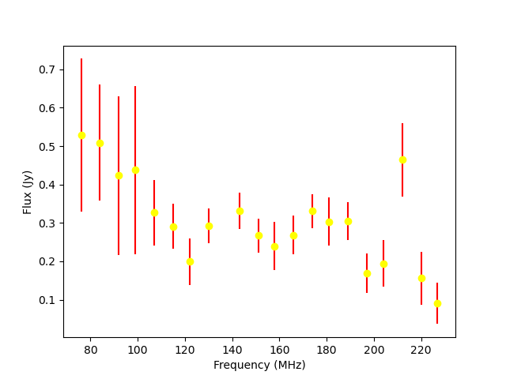
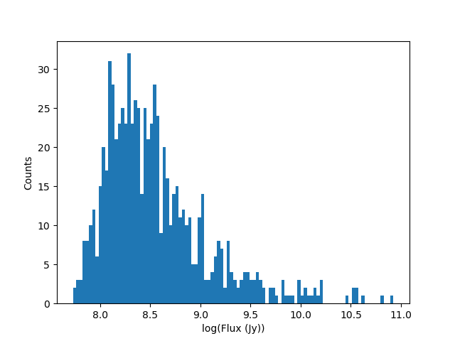

Tutorial
========

By default, following the tutorial will write any files to the current working directory.
Alternatively you can change the location the output files are saved to
by changing the arguments to the ``os.path.join`` calls.
When running the tutorial during test suite execution,
output files are written to a temporary directory created by pytest.

--------
SkyModel
--------

SkyModel is the primary user class, it can represent catalogs of point sources or
diffuse models as HEALPix maps. A number of methods are available for reading in and
writing out files as well as various transformations, including calculating fully
polarized coherencies in the local Alt/Az basis (useful for visibility simulators).
This tutorial should give a basic introduction to all the methods.

SkyModel: Reading in files and creating SkyModel objects
--------------------------------------------------------

a) FHD
******
.. code-block:: python

  >>> import os
  >>> from pyradiosky import SkyModel
  >>> from pyradiosky.data import DATA_PATH
  >>> sm = SkyModel()

  >>> # Use the `read` method, optionally specify the file type. FHD default: expand_extended=True.
  >>> filename = os.path.join(DATA_PATH, "fhd_catalog.sav")
  >>> sm.read(filename)
  >>> # If the file type is not properly recognized, set the `filetype` parameter
  >>> sm.read(filename, filetype="fhd")

  >>> # Use the `from_file` method to create SkyModel object without initalizing
  >>> # an empty object, optionally specify the file type.
  >>> # FHD default: expand_extended=True.
  >>> sm = SkyModel.from_file(filename)

b) GLEAM
********
.. code-block:: python

  >>> import os
  >>> from pyradiosky import SkyModel
  >>> from pyradiosky.data import DATA_PATH
  >>> sm = SkyModel()

  >>> # Use the `read` method, optionally specify the file type. GLEAM defaults: spectral_type="subband", with_error=False.
  >>> filename = os.path.join(DATA_PATH, "gleam_50srcs.vot")
  >>> sm.read(filename)

  >>> # Use the `from_file` method to create SkyModel object without initalizing
  >>> # an empty object, optionally specify the file type.
  >>> # GLEAM defaults: spectral_type="subband", with_error=False.
  >>> sm = SkyModel.from_file(filename)

c) VOTable
**********
.. code-block:: python

  >>> import os
  >>> from pyradiosky import SkyModel
  >>> from pyradiosky.data import DATA_PATH
  >>> sm = SkyModel()

  >>> # Use the `read` method, optionally specify the file type. VOTable required parameters: table_name, id_column,
  >>> # lon_column, lat_column, and flux_columns.
  >>> filename = os.path.join(DATA_PATH, "simple_test.vot")
  >>> # The following are all functionally the same:
  >>> sm.read(filename, table_name="VIII_1000_single", id_column="source_id",
  ...         lon_column="RAJ2000", lat_column="DEJ2000", frame="fk5", flux_columns="Si")

  >>> # Use the `from_file` method to create SkyModel object without initalizing
  >>> # an empty object, optionally specify the file type.
  >>> # VOTable required parameters: table_name, id_column, lon_column, lat_column, and flux_columns.
  >>> sm = SkyModel.from_file(filename, table_name="VIII_1000_single", id_column="source_id",
  ...                         lon_column="RAJ2000", lat_column="DEJ2000", frame="fk5", flux_columns="Si")

d) text
*******
.. code-block:: python

  >>> import os
  >>> from pyradiosky import SkyModel
  >>> from pyradiosky.data import DATA_PATH
  >>> sm = SkyModel()

  >>> # Use the `read` method, optionally specify the file type. See API docs for required columns of text file.
  >>> filename = os.path.join(DATA_PATH, "pointsource_catalog.txt")
  >>> sm.read(filename)

  >>> # Use the `from_file` method to create SkyModel object without initalizing
  >>> # an empty object, optionally specify the file type.
  >>> sm = SkyModel.from_file(filename)

e) skyh5
********
.. code-block:: python

  >>> import os
  >>> from pyradiosky import SkyModel
  >>> from pyradiosky.data import DATA_PATH
  >>> sm = SkyModel()

  >>> # Use the `read` method, optionally specify the file type.
  >>> filename = os.path.join(DATA_PATH, "gsm_icrs.skyh5")
  >>> sm.read(filename)

  >>> # Use the `from_file` method to create SkyModel object without initalizing
  >>> # an empty object, optionally specify the file type.
  >>> sm = SkyModel.from_file(filename)

SkyModel: Plotting
------------------

a) using extended_model_group attribute
*********************************************
.. code-block:: python

  >>> import os
  >>> import numpy as np
  >>> import matplotlib.pyplot as plt # doctest: +SKIP
  >>> from pyradiosky import SkyModel
  >>> from pyradiosky.data import DATA_PATH
  >>> sm = SkyModel()

  >>> filename = os.path.join(DATA_PATH, "fhd_catalog_with_beam_values.sav")
  >>> sm.read_fhd_catalog(filename)

  >>> plt.scatter(sm.ra, sm.dec) # doctest: +SKIP
  >>> plt.xlabel("RA (deg)") # doctest: +SKIP
  >>> plt.ylabel("DEC (deg)") # doctest: +SKIP
  >>> # for RA to be in conventional order, use .value when integer required
  >>> plt.xlim(max(sm.ra.value), min(sm.ra.value)) # doctest: +SKIP
  >>> # extends axis limits 5% beyond given limits
  >>> plt.autoscale() # doctest: +SKIP
  >>> plt.show() # doctest: +SKIP

  >>> print(sm.Ncomponents)
  4597
  >>> print(sm.Nfreqs)
  1
  >>> print(sm.component_type)
  point
  >>> print(sm.spectral_type)
  spectral_index
  >>> # correction done since catalog reference frequencies had wrong power
  >>> sm.reference_frequency = sm.reference_frequency*10**6
  >>> print(np.unique(sm.reference_frequency))
  [1.82435013e+08 2.15675003e+08] Hz
  >>> print(np.unique(sm.spectral_index))
  [-0.8]
  >>> print(np.unique(sm.extended_model_group))
  ['32768' '32769' '32770']
  >>> # beam amplitude for stokes parameter index = 0 (stokes I or unpolarized), Nfreqs index = 0 (first and only frequency
  >>> # since Nfreqs = 1 for spectral index type), Ncomponents index = : (all components)
  >>> print(np.unique(sm.beam_amp[0,0,:]))
  [0.12874769 0.56623143 0.59106636]

  >>> # Use `calc_frame_coherency` to calculate and optionally save it on the object
  >>> # default is `store=True` which will save it on the object rather than returning it
  >>> sm.calc_frame_coherency()
  >>> # coherency (2 x 2 matrix of electric field correlation) for polarization1 index = 0 (North),
  >>> # polarization2 index = 0 (North), Nfreqs index = 0 (first and only frequency since Nfreqs = 1 for
  >>> # spectral index type), Ncomponents index = 0 (first component)
  >>> print(sm.frame_coherency[0,0,0,0])
  (8.400908470153809+0j) Jy

  >>> # dividing by 10^6 since frequency typically plotted in units of MHz
  >>> plt.scatter(sm.reference_frequency/10**6, sm.spectral_index) # doctest: +SKIP
  >>> plt.xlabel("Reference Frequency (MHz)") # doctest: +SKIP
  >>> plt.ylabel("Spectral Index") # doctest: +SKIP
  >>> plt.show() # doctest: +SKIP

  >>> index_32768 = []
  >>> for j in range(len(sm.extended_model_group)):
  ...     if sm.extended_model_group[j] == "32768":
  ...         # indices for extended model group 32768
  ...         index_32768.append(j)

  >>> # confirming that there is one reference frequency for this extended model group
  >>> print(np.unique(sm.reference_frequency[index_32768]))
  [2.15675003e+08] Hz

  >>> # plots of fluxes are sensible at one frequency since fluxes can change with frequency, plots below provide fluxes
  >>> # when frequency = reference frequency (more on this in at_frequencies section)

  >>> # log taken since these fluxes have different orders of magnitude
  >>> plt.hist(np.log(sm.stokes.value[0,0,index_32768]), bins=20) # doctest: +SKIP
  >>> plt.xlabel("log(Flux (Jy))") # doctest: +SKIP
  >>> plt.ylabel("Counts") # doctest: +SKIP
  >>> plt.show() # doctest: +SKIP

  >>> plt.scatter(x=sm.ra[index_32768],y=sm.dec[index_32768],c=sm.stokes[0,0,index_32768],cmap="plasma") # doctest: +SKIP
  >>> cbar=plt.colorbar(label="Flux (Jy)", orientation="vertical",shrink=.75) # doctest: +SKIP
  >>> plt.xlim(max(sm.ra.value[index_32768]), min(sm.ra.value[index_32768])) # doctest: +SKIP
  >>> plt.autoscale() # doctest: +SKIP
  >>> plt.xlabel("RA (deg)") # doctest: +SKIP
  >>> plt.ylabel("DEC (deg)") # doctest: +SKIP
  >>> plt.show() # doctest: +SKIP

.. image:: Images/fhd_catalog_with_beam_values_radec.png
    :width: 600

.. image:: Images/fhd_catalog_with_beam_values_refspec.png
    :width: 600

.. image:: Images/fhd_catalog_with_beam_values_fluxcounts.png
    :width: 600

.. image:: Images/fhd_catalog_with_beam_values_radec_32768.png
    :width: 600

b) using stokes_error attribute, changing component type
******************************************************
.. code-block:: python

  >>> import os
  >>> from pyradiosky import SkyModel
  >>> from pyradiosky import utils
  >>> import matplotlib.pyplot as plt # doctest: +SKIP
  >>> sm = SkyModel()

  >>> filename = os.path.join(DATA_PATH, "gleam_50srcs.vot")
  >>> sm.read_gleam_catalog(filename, with_error = True)

  >>> # these are centers of frequency bands
  >>> x = sm.freq_array.value/(10**6)
  >>> # flux for stokes parameter = 0 (stokes I or unpolarized), Nfreqs index = : (all frequencies),
  >>> # Ncomponents index = 0 (first component)
  >>> y_error = sm.stokes_error[0,:,0].value
  >>> plt.errorbar(x, y, yerr = y_error, fmt="o", ecolor = "red", color="yellow") # doctest: +SKIP
  >>> plt.xlabel("Frequency (MHz)") # doctest: +SKIP
  >>> plt.ylabel("Flux (Jy)") # doctest: +SKIP
  >>> plt.show() # doctest: +SKIP

  >>> # in_place=True so it’s applied to current object
  >>> sm.assign_to_healpix(16, order="nested", inplace=True)
  >>> print(sm.nside)
  16
  >>> print(sm.hpx_order)
  nested

c) incorporating astropy healpix package (like plotting pixels), changing component type cont., changing frames
***************************************************************************************************************
.. code-block:: python

  >>> import os
  >>> import numpy as np
  >>> import math
  >>> import matplotlib.pyplot as plt # doctest: +SKIP
  >>> from matplotlib.patches import Polygon # doctest: +SKIP
  >>> from pyradiosky import SkyModel
  >>> from pyradiosky.data import DATA_PATH
  >>> from astropy_healpix import HEALPix
  >>> from astropy.coordinates import SkyCoord
  >>> sm = SkyModel()

  >>> filename = os.path.join(DATA_PATH, "gsm_icrs.skyh5")
  >>> sm.read_skyh5(filename)

  >>> plt.scatter(sm.ra, sm.dec) # doctest: +SKIP
  >>> plt.xlim(max(sm.ra.value), min(sm.ra.value)) # doctest: +SKIP
  >>> plt.autoscale() # doctest: +SKIP
  >>> plt.xlabel("RA (deg)") # doctest: +SKIP
  >>> plt.ylabel("DEC (deg)") # doctest: +SKIP
  >>> plt.show() # doctest: +SKIP

  >>> # a HEALPix map has Ncomponents = 12*nside^2, where components are pixels
  >>> print(sm.Ncomponents)
  768
  >>> print(sm.Nfreqs)
  10
  >>> print(sm.component_type)
  healpix
  >>> print(sm.spectral_type)
  full
  >>> print(sm.freq_array)
  [5.00000000e+07 6.11111111e+07 7.22222222e+07 8.33333333e+07
   9.44444444e+07 1.05555556e+08 1.16666667e+08 1.27777778e+08
   1.38888889e+08 1.50000000e+08] Hz
  >>> print(sm.hpx_inds[:10])
  [0 1 2 3 4 5 6 7 8 9]
  >>> print(sm.hpx_order)
  ring
  >>> print(sm.nside)
  8
  >>> print(sm.frame)
  icrs
  >>> # Use `calc_frame_coherency` to calculate the frame coherency, set store=False to
  >>> # return it and not store it.
  >>> frame_coherency = sm.calc_frame_coherency(store=False)
  >>> print(frame_coherency[:,:,0,0])
  [[2352.45649693+0.j    0.        +0.j]
   [   0.        +0.j 2352.45649693+0.j]] K

  >>> plt.hist(np.log(sm.stokes.value[0,0,:]), bins=100) # doctest: +SKIP
  >>> plt.xlabel("log(Flux (Jy))") # doctest: +SKIP
  >>> plt.ylabel("Counts") # doctest: +SKIP
  >>> plt.show() # doctest: +SKIP

  >>> sm_point = sm.copy()
  >>> sm_point.healpix_to_point()
  >>> print(sm_point.ra[:3])
  [45d00m00s 135d00m00s 225d00m00s]
  >>> print(sm_point.dec[:3])
  [84d08m59.03857067s 84d08m59.03857067s 84d08m59.03857067s]
  >>> print(sm_point.dec[:3].value)
  [84.14973294 84.14973294 84.14973294]
  >>> sm_point.transform_to("galactic")
  >>> sm_point.transform_to("icrs")
  >>> # confirms same RA and DEC after transforming point catalog back to icrs frame
  >>> print(sm_point.ra[:3])
  [45d00m00s 135d00m00s 225d00m00s]
  >>> print(sm_point.dec[:3])
  [84d08m59.03857067s 84d08m59.03857067s 84d08m59.03857067s]

  >>> # used instead of transform_to since this interpolates to new pixel centers, as pixels defined by coordinate system
  >>> sm.healpix_interp_transform("galactic")
  >>> hp = HEALPix(sm.nside, sm.hpx_order, sm.frame)
  >>> print(hp.npix)
  768
  >>> print(hp.pixel_area)
  0.016362461737446838 sr
  >>> print(hp.pixel_resolution)
  439.74226071262797 arcmin

  >>> coord = SkyCoord("00h42m44.3503s +41d16m08.634s", frame="galactic")
  >>> print(round(hp.interpolate_bilinear_skycoord(coord, sm.stokes.value[0,0,:])))
  6540

  >>> gal_l, gal_b = sm.get_lon_lat()
  >>> gal_l_pi = (gal_l.radian/math.pi)[:3]
  >>> gal_b_cos = np.cos(gal_b.radian)[:3]
  >>> fig, ax = plt.subplots() # doctest: +SKIP
  >>> ax.scatter(gal_l_pi, gal_b_cos, alpha = 0) # doctest: +SKIP
  >>> ax.set_xlabel("phi / pi") # doctest: +SKIP
  >>> ax.set_ylabel("cos(theta)") # doctest: +SKIP
  >>> for i, txt in enumerate(sm.hpx_inds[:3]): # doctest: +SKIP
  ...     #adds pixel index at center of each pixel
  ...     ax.annotate(txt, (gal_l_pi[i], gal_b_cos[i]), fontsize=8) # doctest: +SKIP
  >>> for hpx_ind in sm.hpx_inds[:3]: # doctest: +SKIP
  ...     lon = hp.boundaries_lonlat(hpx_ind, 100)[0]/math.pi # doctest: +SKIP
  ...     lat = np.cos(hp.boundaries_lonlat(hpx_ind, 100)[1]) # doctest: +SKIP
  ...     lon = lon.value # doctest: +SKIP
  ...     lat = lat.value # doctest: +SKIP
  ...     vertices = np.vstack([lon.ravel(), lat.ravel()]).transpose() # doctest: +SKIP
  ...     p = Polygon(vertices, closed=True, edgecolor="black", facecolor="none") # doctest: +SKIP
  ...     # adds boundaries around each pixel
  ...     ax.add_patch(p) # doctest: +SKIP

  >>> gal_l, gal_b = sm.get_lon_lat()
  >>> gal_l_pi = (gal_l.radian/math.pi)[:3]
  >>> gal_b_cos = np.cos(gal_b.radian)[:3]
  >>> fig, ax = plt.subplots() # doctest: +SKIP
  >>> ax.scatter(gal_l_pi, gal_b_cos, alpha = 0) # doctest: +SKIP
  >>> ax.set_xlabel("phi / pi") # doctest: +SKIP
  >>> ax.set_ylabel("cos(theta)") # doctest: +SKIP
  >>> # nested instead of ring
  >>> for ind, txt in enumerate(hp.ring_to_nested(sm.hpx_inds)[:3]): # doctest: +SKIP
  ...     ax.annotate(txt, (gal_l_pi[ind], gal_b_cos[ind]), fontsize=8) # doctest: +SKIP
  >>> for hpx_ind in sm.hpx_inds[:3]: # doctest: +SKIP
  ...     lon = hp.boundaries_lonlat(hpx_ind, 100)[0]/math.pi # doctest: +SKIP
  ...     lat = np.cos(hp.boundaries_lonlat(hpx_ind, 100)[1]) # doctest: +SKIP
  ...     lon = lon.value # doctest: +SKIP
  ...     lat = lat.value # doctest: +SKIP
  ...     vertices = np.vstack([lon.ravel(), lat.ravel()]).transpose() # doctest: +SKIP
  ...     p = Polygon(vertices, closed=True, edgecolor="black", facecolor="none") # doctest: +SKIP
  ...     ax.add_patch(p) # doctest: +SKIP

.. image:: Images/gsm_icrs_phiz_ring.png
    :width: 600

.. image:: Images/gsm_icrs_phiz_nested.png
    :width: 600

SkyModel: Creating and writing out catalogs
-------------------------------------------

a) creating and writing out healpix catalog, using get_lon_lat method
*********************************************************************
.. code-block:: python

  >>> import os
  >>> import numpy as np
  >>> import matplotlib.pyplot as plt # doctest: +SKIP
  >>> from astropy import units
  >>> from pyradiosky import SkyModel

  >>> sm = SkyModel(
  ...   component_type="healpix", nside=1, hpx_inds=[0,1,2,3],
  ...   stokes=np.zeros((4,1,4)) * units.K,
  ...   spectral_type="flat", hpx_order="ring", frame="icrs"
  ... )
  >>> print(sm.get_lon_lat())
  (<Longitude [ 45., 135., 225., 315.] deg>, <Latitude [41.8103149, 41.8103149, 41.8103149, 41.8103149] deg>)

  >>> write_file = os.path.join(".", "zero.skyh5")
  >>> sm.write_skyh5(write_file)

b) creating and writing out point catalog, using calculate_rise_set_lsts and clear_time_position_specific_params methods
************************************************************************************************************************
.. code-block:: python

  >>> import os
  >>> import numpy as np
  >>> from pyradiosky import SkyModel
  >>> from pyradiosky.data import DATA_PATH
  >>> from astropy import units
  >>> from astropy.coordinates import (
  ...     SkyCoord,
  ...     EarthLocation,
  ...     Angle,
  ...     AltAz,
  ...     Longitude,
  ...     Latitude,
  ...     Galactic)
  >>> from astropy.time import Time

  >>> array_location = EarthLocation(lat="-30d43m17.5s", lon="21d25m41.9s", height=1073.0)
  >>> time = Time("2015-03-01 00:00:00", scale="utc", location=array_location)
  >>> source_coord = SkyCoord(
  ...     alt=Angle(90, unit=units.deg),
  ...     az=Angle(0, unit=units.deg),
  ...     obstime=time,
  ...     frame="altaz",
  ...     location=array_location)
  >>> icrs_coord = source_coord.transform_to("icrs")
  >>> # unpolarized only
  >>> sm = SkyModel(
  ...   name="zen_source", skycoord=icrs_coord, stokes=[1.0, 0, 0, 0] * units.Jy,
  ...   spectral_type="flat", history = "drawn from zenith_skymodel in test_skymodel.py"
  ... )
  >>> print(sm.check(check_extra=True, run_check_acceptability=True))
  True

  >>> print(sm.name)
  ['zen_source']
  >>> # print(sm.history) to learn where the sky model is drawn from and how it is read/written
  >>> sm.update_positions(time, array_location)

  >>> sm.calculate_rise_set_lsts(array_location.lat)
  >>> print(sm._rise_lst)
  [1.16240067]
  >>> print(sm._set_lst)
  [5.11057854]

  >>> # coherency in local alt/az basis can be different from coherency in ra/dec basis
  >>> print(sm.coherency_calc()[:,:,0,0])
  [[0.5+0.j 0. +0.j]
   [0. +0.j 0.5+0.j]] Jy

  >>> print(sm.time)
  2015-03-01 00:00:00.000
  >>> print(sm.telescope_location)
  (5109342.76037543, 2005241.90402741, -3239939.46926403) m
  >>> print(sm.alt_az)
  [[1.57079633]
   [1.72876609]]
  >>> print(sm.pos_lmn)
  [[ 2.12981215e-13]
   [-3.39272742e-14]
   [ 1.00000000e+00]]
  >>> print(sm.above_horizon)
  [ True]
  >>> sm.clear_time_position_specific_params()
  >>> print(sm.time)
  None
  >>> print(sm.telescope_location)
  None
  >>> print(sm.alt_az)
  None
  >>> print(sm.pos_lmn)
  None
  >>> print(sm.above_horizon)
  None

  >>> for param in sm.ncomponent_length_params:
  ...     print(param)
  _above_horizon
  _extended_model_group
  _hpx_inds
  _name
  _reference_frequency
  _skycoord
  _spectral_index
  >>> print(sm.Ncomponents)
  1

  >>> # works for any point component type
  >>> write_file = os.path.join(".", "zen_source.txt" )
  >>> sm.write_text_catalog(write_file)

SkyModel: Selecting data
------------------------

a) using cut_nonrising method
*****************************
.. code-block:: python

  >>> import os
  >>> import numpy as np
  >>> from pyradiosky import SkyModel
  >>> from pyradiosky.data import DATA_PATH
  >>> from astropy import units
  >>> from astropy.coordinates import EarthLocation
  >>> from astropy.time import Time, TimeDelta

  >>> array_location = EarthLocation(lat="-30d43m17.5s", lon="21d25m41.9s", height=1073.0)
  >>> time = Time("2015-03-01 00:00:00", scale="utc", location=array_location)

  >>> Nras = 20
  >>> Ndecs = 20
  >>> Nsrcs = Nras * Ndecs

  >>> lon = array_location.lon.deg
  >>> ra = np.linspace(lon - 90, lon + 90, Nras)
  >>> dec = np.linspace(-90, 90, Ndecs)

  >>> # to create coordinates for the 400 sources
  >>> ra, dec = map(np.ndarray.flatten, np.meshgrid(ra, dec))
  >>> print(len(ra))
  400
  >>> print(len(dec))
  400
  >>> ra = Longitude(ra, units.deg)
  >>> dec = Latitude(dec, units.deg)

  >>> names = ["src{}".format(i) for i in range(Nsrcs)]
  >>> stokes = np.zeros((4, 1, Nsrcs)) * units.Jy
  >>> # stokes I (unpolarized) sources given 1 Jy flux, otherwise no flux
  >>> stokes[0, ...] = 1.0 * units.Jy

  >>> sm = SkyModel(name=names, ra=ra, dec=dec, frame="icrs", stokes=stokes, spectral_type="flat")

  >>> sm2 = sm.cut_nonrising(array_location.lat, inplace=False)

  >>> print(sm.Ncomponents)
  400
  >>> print(sm2.Ncomponents)
  320

b) using plotly package and select and select methods
*****************************************************
.. code-block:: python

  >>> import os
  >>> import numpy as np
  >>> import matplotlib.pyplot as plt # doctest: +SKIP
  >>> from pyradiosky import SkyModel
  >>> from pyradiosky.data import DATA_PATH
  >>> from astropy import units
  >>> from astropy.coordinates import (
  ...     SkyCoord,
  ...     EarthLocation,
  ...     Angle,
  ...     AltAz,
  ...     Longitude,
  ...     Latitude,
  ...     Galactic)
  >>> import plotly.express as px # doctest: +SKIP
  >>> sm = SkyModel()

  >>> filename = os.path.join(DATA_PATH, "gleam_50srcs.vot")
  >>> sm.read_gleam_catalog(filename)

  >>> sm.jansky_to_kelvin()

  >>> plt.scatter(x=sm.ra, y=sm.dec, c=sm.stokes[0,13,:], cmap="plasma") # doctest: +SKIP
  >>> cbar=plt.colorbar(label="Flux (K)", orientation="vertical",shrink=.75) # doctest: +SKIP
  >>> plt.xlim(max(sm.ra.value), min(sm.ra.value)) # doctest: +SKIP
  >>> plt.autoscale() # doctest: +SKIP
  >>> plt.xlabel("RA (deg)") # doctest: +SKIP
  >>> plt.ylabel("DEC (deg)") # doctest: +SKIP
  >>> plt.show() # doctest: +SKIP

  >>> sm.kelvin_to_jansky()

  >>> plt.scatter(x=sm.ra, y=sm.dec, c=sm.stokes[0,13,:], cmap="plasma") # doctest: +SKIP
  >>> cbar=plt.colorbar(label="Flux (Jy)", orientation="vertical",shrink=.75) # doctest: +SKIP
  >>> plt.xlim(max(sm.ra.value), min(sm.ra.value)) # doctest: +SKIP
  >>> plt.autoscale() # doctest: +SKIP
  >>> plt.xlabel("RA (deg)") # doctest: +SKIP
  >>> plt.ylabel("DEC (deg)") # doctest: +SKIP
  >>> plt.show() # doctest: +SKIP

  >>> plt.hist(np.log(sm.stokes.value[0,13,:]), bins=10) # doctest: +SKIP
  >>> plt.xlabel("log(Flux (Jy))") # doctest: +SKIP
  >>> plt.ylabel("Counts") # doctest: +SKIP
  >>> plt.show() # doctest: +SKIP

  >>> print(sm.freq_array)
  [7.60e+07 8.40e+07 9.20e+07 9.90e+07 1.07e+08 1.15e+08 1.22e+08 1.30e+08
   1.43e+08 1.51e+08 1.58e+08 1.66e+08 1.74e+08 1.81e+08 1.89e+08 1.97e+08
   2.04e+08 2.12e+08 2.20e+08 2.27e+08] Hz

  >>> sm2 = sm.copy()
  >>> sm2.select(lon_range = Longitude([340, 360], units.deg))
  >>> plt.scatter(x=sm2.ra, y=sm2.dec, c=sm2.stokes[0,13,:], cmap="plasma") # doctest: +SKIP
  >>> cbar=plt.colorbar(label="Flux (Jy)", orientation="vertical",shrink=.75) # doctest: +SKIP
  >>> plt.xlim(max(sm.ra.value), min(sm.ra.value)) # doctest: +SKIP
  >>> plt.autoscale() # doctest: +SKIP
  >>> plt.xlabel("RA (deg)") # doctest: +SKIP
  >>> plt.ylabel("DEC (deg)") # doctest: +SKIP
  >>> plt.show() # doctest: +SKIP

  >>> sm3 = sm.copy()
  >>> sm3.select(min_brightness=.1*units.Jy, max_brightness=1*units.Jy, brightness_freq_range=[100*10**6,
  ...            200*10**6]*units.Hz)
  >>> plt.scatter(x=sm3.ra, y=sm3.dec, c=sm3.stokes[0,13,:], cmap="plasma") # doctest: +SKIP
  >>> cbar=plt.colorbar(label="Flux (Jy)", orientation="vertical",shrink=.75) # doctest: +SKIP
  >>> plt.xlim(max(sm.ra.value), min(sm.ra.value)) # doctest: +SKIP
  >>> plt.autoscale() # doctest: +SKIP
  >>> plt.xlabel("RA (deg)") # doctest: +SKIP
  >>> plt.ylabel("DEC (deg)") # doctest: +SKIP
  >>> plt.show() # doctest: +SKIP

  >>> plt.hist(np.log(sm3.stokes.value[0,13,:]), bins=10) # doctest: +SKIP
  >>> plt.xlabel("log(Flux (Jy))") # doctest: +SKIP
  >>> plt.ylabel("Counts") # doctest: +SKIP
  >>> plt.show() # doctest: +SKIP

  >>> fig = px.scatter(x=sm2.ra.value, y=sm2.dec.value, color=sm2.stokes[0,13,:].value, # doctest: +SKIP
  ...                  labels={"x": "RA (deg)", "y": "DEC (deg)", "color": "Flux (Jy)"}) # doctest: +SKIP
  >>> fig.add_trace(px.scatter(x=sm3.ra.value, y=sm3.dec.value, symbol_sequence=["x"], # doctest: +SKIP
  ...                          color=sm3.stokes[0,13,:].value, labels={"x": "RA (deg)", "y": "DEC (deg)", # doctest: +SKIP
  ...                          "color": "Flux (Jy)"}).data[0]) # doctest: +SKIP
  >>> # for RA to be in conventional order
  >>> fig.update_layout(xaxis_range=[max(sm3.ra.value),min(sm3.ra.value)]) # doctest: +SKIP
  >>> # like autoscale
  >>> fig["layout"]["xaxis"].update(autorange = True) # doctest: +SKIP
  >>> fig.show() # doctest: +SKIP

  >>> sm4 = sm.select(
  ...   min_brightness=0.2 * units.Jy, max_brightness=1.5 * units.Jy, inplace=False
  ... )

  >>> print(sm.Ncomponents)
  50
  >>> print(sm4.Ncomponents)
  9

.. image:: Images/gleam_50srcs_radec_K.png
    :width: 600

.. image:: Images/gleam_50srcs_radec_Jy.png
    :width: 600

.. image:: Images/gleam_50srcs_fluxcounts.png
    :width: 600

.. image:: Images/gleam_50srcs_radec_lonselect.png
    :width: 600

.. image:: Images/gleam_50srcs_fluxcounts_fluxselect.png
    :width: 600

.. image:: Images/gleam_50srcs_radec_compare.png
    :width: 600

c) using select method, incorporating astropy healpix package
*********************************************************************
.. code-block:: python

  >>> import os
  >>> import numpy as np
  >>> import math
  >>> import matplotlib.pyplot as plt # doctest: +SKIP
  >>> from pyradiosky import SkyModel
  >>> from pyradiosky.data import DATA_PATH
  >>> from astropy import units as u
  >>> from astropy_healpix import HEALPix
  >>> sm = SkyModel()

  >>> filename = os.path.join(DATA_PATH, "gsm_icrs.skyh5")
  >>> sm.read_skyh5(filename)

  >>> plt.scatter(sm.ra, sm.dec) # doctest: +SKIP
  >>> plt.xlim(max(sm.ra.value), min(sm.ra.value)) # doctest: +SKIP
  >>> plt.autoscale() # doctest: +SKIP
  >>> plt.xlabel("RA (deg)") # doctest: +SKIP
  >>> plt.ylabel("DEC (deg)") # doctest: +SKIP
  >>> plt.show() # doctest: +SKIP

  >>> sm_new = sm.copy()
  >>> inds = list(range(0, 24))
  >>> sm_new.select(component_inds=inds)

  >>> plt.scatter(sm_new.ra, sm_new.dec) # doctest: +SKIP
  >>> plt.xlim(max(sm.ra.value), min(sm.ra.value)) # doctest: +SKIP
  >>> plt.autoscale() # doctest: +SKIP
  >>> plt.xlabel("RA (deg)") # doctest: +SKIP
  >>> plt.ylabel("DEC (deg)") # doctest: +SKIP
  >>> plt.show() # doctest: +SKIP

  >>> write_file = os.path.join(".", "gsm_icrs_new.skyh5" )
  >>> sm_new.write_skyh5(write_file)

  >>> # used instead of transform_to since this interpolates to new pixel centers, as pixels defined by coordinate system
  >>> sm.healpix_interp_transform("galactic")
  >>> hp = HEALPix(sm.nside, sm.hpx_order, sm.frame)

  >>> cone_index = hp.cone_search_lonlat(10 * u.deg, 10 * u.deg, radius=5 * u.deg)
  >>> print(cone_index)
  [304 273 337 305]
  >>> lon, lat = sm.get_lon_lat()
  >>> plt.scatter(lon.value[cone_index], lat.value[cone_index]) # doctest: +SKIP
  >>> plt.xlim(max(lon.value[cone_index]), min(lon.value[cone_index])) # doctest: +SKIP
  >>> plt.autoscale() # doctest: +SKIP
  >>> plt.xlabel("Galactic Longitude (deg)") # doctest: +SKIP
  >>> plt.ylabel("Galactic Latitude (deg)") # doctest: +SKIP
  >>> plt.show() # doctest: +SKIP

  >>> neighbours_10 = hp.neighbours(10)
  >>> print(neighbours_10)
  [21 20  9  2  3 11 22 37]
  >>> plt.scatter(lon.value[neighbours_10], lat.value[neighbours_10]) # doctest: +SKIP
  >>> plt.xlim(max(lon.value[neighbours_10]), min(lon.value[neighbours_10])) # doctest: +SKIP
  >>> plt.autoscale() # doctest: +SKIP
  >>> plt.xlabel("Galactic Longitude (deg)") # doctest: +SKIP
  >>> plt.ylabel("Galactic Latitude (deg)") # doctest: +SKIP
  >>> plt.show() # doctest: +SKIP

.. image:: Images/gsm_icrs_radec_indselect.png
    :width: 600

.. image:: Images/gsm_icrs_glgb_coneselect.png
    :width: 600

.. image:: Images/gsm_icrs_glgb_neighborselect.png
    :width: 600

SkyModel: Concatenating data
------------------------------------------

a) using select and concat methods
*******
.. code-block:: python

  >>> import os
  >>> import numpy as np
  >>> import matplotlib.pyplot as plt # doctest: +SKIP
  >>> from pyradiosky import SkyModel
  >>> from pyradiosky.data import DATA_PATH
  >>> from astropy import units
  >>> from astropy.coordinates import (
  ...     SkyCoord,
  ...     EarthLocation,
  ...     Angle,
  ...     AltAz,
  ...     Longitude,
  ...     Latitude,
  ...     Galactic)
  >>> sm = SkyModel()

  >>> filename = os.path.join(DATA_PATH, "pointsource_catalog.txt")
  >>> sm.read_text_catalog(filename)

  >>> plt.scatter(x=sm.ra, y=sm.dec, c=sm.stokes[0,0,:], cmap="plasma") # doctest: +SKIP
  >>> cbar=plt.colorbar(label="Flux (Jy)", orientation="vertical",shrink=.75) # doctest: +SKIP
  >>> plt.xlim(max(sm.ra.value), min(sm.ra.value)) # doctest: +SKIP
  >>> plt.autoscale() # doctest: +SKIP
  >>> plt.xlabel("RA (deg)") # doctest: +SKIP
  >>> plt.ylabel("DEC (deg)") # doctest: +SKIP
  >>> plt.show() # doctest: +SKIP

  >>> sm2 = sm.copy()
  >>> sm2.select(lon_range = Longitude([1.26, 1.31], units.deg))

  >>> sm3 = sm.copy()
  >>> sm3.select(lon_range = Longitude([1.31, 1.36], units.deg))

  >>> sm_new = sm2.concat(sm3, inplace=False)
  >>> write_file = os.path.join(".", "2srcs.txt" )
  >>> sm_new.write_text_catalog(write_file)

  >>> plt.scatter(x=sm_new.ra, y=sm_new.dec, c=sm_new.stokes[0,0,:], cmap="plasma") # doctest: +SKIP
  >>> cbar=plt.colorbar(label="Flux (Jy)", orientation="vertical",shrink=.75) # doctest: +SKIP
  >>> plt.xlim(max(sm_new.ra.value), min(sm_new.ra.value)) # doctest: +SKIP
  >>> plt.autoscale() # doctest: +SKIP
  >>> plt.xlabel("RA (deg)") # doctest: +SKIP
  >>> plt.ylabel("DEC (deg)") # doctest: +SKIP
  >>> plt.show() # doctest: +SKIP

.. image:: Images/pointsource_catalog_radec.png
    :width: 600

.. image:: Images/pointsource_catalog_radec_concat.png
    :width: 600

SkyModel: using at_frequencies method
-------------------------------------

a) subband spectral type
********************************
.. code-block:: python

  >>> import os
  >>> from pyradiosky import SkyModel
  >>> from pyradiosky.data import DATA_PATH
  >>> from astropy import units
  >>> import matplotlib.pyplot as plt # doctest: +SKIP
  >>> sm = SkyModel()

  >>> filename = os.path.join(DATA_PATH, "gleam_50srcs.vot")
  >>> sm.read_gleam_catalog(filename)

  >>> print(sm.freq_array)
  [7.60e+07 8.40e+07 9.20e+07 9.90e+07 1.07e+08 1.15e+08 1.22e+08 1.30e+08
   1.43e+08 1.51e+08 1.58e+08 1.66e+08 1.74e+08 1.81e+08 1.89e+08 1.97e+08
   2.04e+08 2.12e+08 2.20e+08 2.27e+08] Hz

  >>> plt.scatter(x=sm.ra, y=sm.dec, c=sm.stokes[0,4,:], cmap="plasma") # doctest: +SKIP
  >>> cbar=plt.colorbar(label="Flux (Jy)", orientation="vertical",shrink=.75) # doctest: +SKIP
  >>> plt.xlim(max(sm.ra.value), min(sm.ra.value)) # doctest: +SKIP
  >>> plt.autoscale() # doctest: +SKIP
  >>> plt.xlabel("RA (deg)") # doctest: +SKIP
  >>> plt.ylabel("DEC (deg)") # doctest: +SKIP
  >>> plt.show() # doctest: +SKIP

  >>> sm.at_frequencies(freqs=[200*10**6]*units.Hz, inplace=True, freq_interp_kind="cubic", nan_handling="clip",
  ...                   run_check=True, atol=None)

  >>> print(sm.freq_array)
  [2.e+08] Hz

  >>> plt.scatter(x=sm.ra, y=sm.dec, c=sm.stokes[0,0,:], cmap="plasma") # doctest: +SKIP
  >>> cbar=plt.colorbar(label="Flux (Jy)", orientation="vertical",shrink=.75) # doctest: +SKIP
  >>> plt.xlim(max(sm.ra.value), min(sm.ra.value)) # doctest: +SKIP
  >>> plt.autoscale() # doctest: +SKIP
  >>> plt.xlabel("RA (deg)") # doctest: +SKIP
  >>> plt.ylabel("DEC (deg)") # doctest: +SKIP
  >>> plt.show() # doctest: +SKIP

.. image:: Images/gleam_50srcs_radec_oldfreq.png
    :width: 600

.. image:: Images/gleam_50srcs_radec_newfreq.png
    :width: 600

b) spectral index spectral type
*************************************
.. code-block:: python

  >>> import os
  >>> import numpy as np
  >>> import matplotlib.pyplot as plt # doctest: +SKIP
  >>> from pyradiosky import SkyModel
  >>> from pyradiosky.data import DATA_PATH
  >>> sm = SkyModel()

  >>> filename = os.path.join(DATA_PATH, "fhd_catalog.sav")
  >>> sm.read_fhd_catalog(filename)

  >>> # correction done since catalog reference frequencies had wrong power
  >>> sm.reference_frequency = sm.reference_frequency*10**6
  >>> print(np.unique(sm.reference_frequency))
  [7.40000000e+07 1.80000000e+08 1.81000000e+08 2.15675003e+08] Hz

  >>> print(sm.stokes.value[0,0,8235])
  0.5017849802970886
  >>> print(sm.reference_frequency[8235])
  215675003.0517578 Hz
  >>> # last component (at index 8325) was chosen due to nonzero spectral index
  >>> print(sm.spectral_index[8235])
  -0.8

  >>> x = np.linspace(75*10**6, 225*10**6, 16)
  >>> # y = sm.stokes.value[0,0,8235] (flux is accurate for a frequency x) when x = sm.reference_frequency[8235]
  >>> y = sm.stokes.value[0,0,8235]*(x/sm.reference_frequency[8235])**sm.spectral_index[8235]
  >>> plt.plot(x/10**6,y) # doctest: +SKIP
  >>> plt.scatter(sm.reference_frequency[8235]/10**6, sm.stokes.value[0,0,8235]) # doctest: +SKIP
  >>> plt.xlabel("Reference Frequency (MHz)") # doctest: +SKIP
  >>> plt.ylabel("Flux (Jy)") # doctest: +SKIP
  >>> # this plot illustrates how flux changes with frequency
  >>> plt.show() # doctest: +SKIP

  >>> print(sm.stokes.value[0,0,0])
  1.185837984085083
  >>> print(sm.reference_frequency[0])
  181000000.0 Hz
  >>> print(sm.spectral_index[0])
  0.0

  >>> x = np.linspace(75*10**6, 225*10**6, 16)
  >>> y = sm.stokes.value[0,0,0]*(x/sm.reference_frequency[0]/10**6)**sm.spectral_index[0]
  >>> plt.plot(x/10**6,y) # doctest: +SKIP
  >>> plt.scatter(sm.reference_frequency[0]/10**6, sm.stokes.value[0,0,0]) # doctest: +SKIP
  >>> plt.xlabel("Reference Frequency (MHz)") # doctest: +SKIP
  >>> plt.ylabel("Flux (Jy)") # doctest: +SKIP
  >>> # if spectral index is 0, the spectrum is flat meaning same flux for all frequencies, that's why the
  >>> # at_frequencies method for the flat spectral type just copies
  >>> plt.show() # doctest: +SKIP

  >>> sm.at_frequencies(freqs=[200*10**6]*units.Hz, inplace=True, run_check=True, atol=None)
  >>> print(f"{sm.stokes[0,0,8235]:.4f}")
  0.5330 Jy

.. image:: Images/fhd_catalog_refflux_nonzerospec.png
    :width: 600

.. image:: Images/fhd_catalog_refflux_zerospec.png
    :width: 600

c) full spectral type
*****************************
.. code-block:: python

  >>> import os
  >>> import numpy as np
  >>> import matplotlib.pyplot as plt # doctest: +SKIP
  >>> from pyradiosky import SkyModel
  >>> from pyradiosky.data import DATA_PATH
  >>> sm = SkyModel()

  >>> filename = os.path.join(DATA_PATH, "gsm_icrs.skyh5")
  >>> sm.read_skyh5(filename)

  >>> print(sm.freq_array)
  [5.00000000e+07 6.11111111e+07 7.22222222e+07 8.33333333e+07
   9.44444444e+07 1.05555556e+08 1.16666667e+08 1.27777778e+08
   1.38888889e+08 1.50000000e+08] Hz

  >>> plt.hist(np.log(sm.stokes.value[0,9,:]), bins=100) # doctest: +SKIP
  >>> plt.xlabel("log(Flux (Jy))") # doctest: +SKIP
  >>> plt.ylabel("Counts") # doctest: +SKIP
  >>> plt.show() # doctest: +SKIP

  >>> sm.at_frequencies(freqs=[150*10**6]*units.Hz, inplace=True, run_check=True, atol=None)
  >>> print(sm.freq_array)
  [1.5e+08] Hz

  >>> plt.hist(np.log(sm.stokes.value[0,0,:]), bins=100) # doctest: +SKIP
  >>> plt.xlabel("log(Flux (Jy))") # doctest: +SKIP
  >>> plt.ylabel("Counts") # doctest: +SKIP
  >>> plt.show() # doctest: +SKIP

.. image:: Images/gsm_icrs_fluxcounts_150MHzfreqind.png
    :width: 600

.. image:: Images/gsm_icrs_fluxcounts_150MHzatfreq.png
    :width: 600
